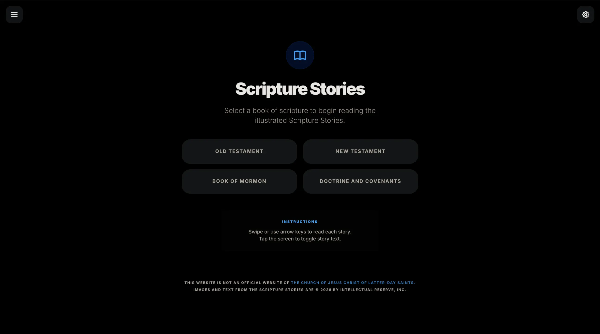
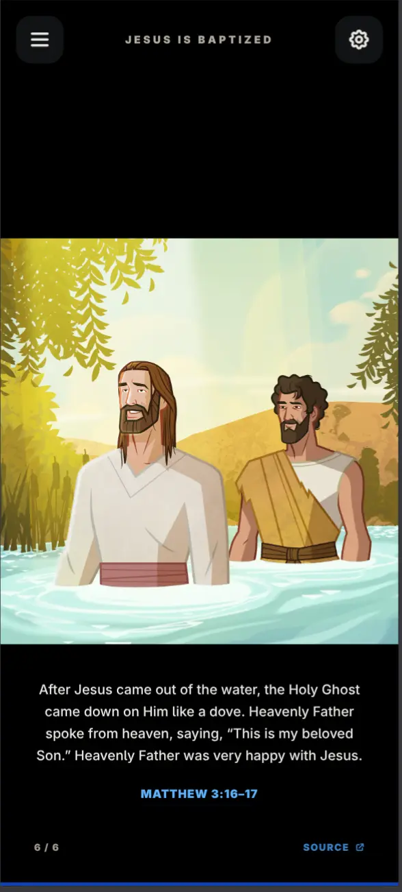
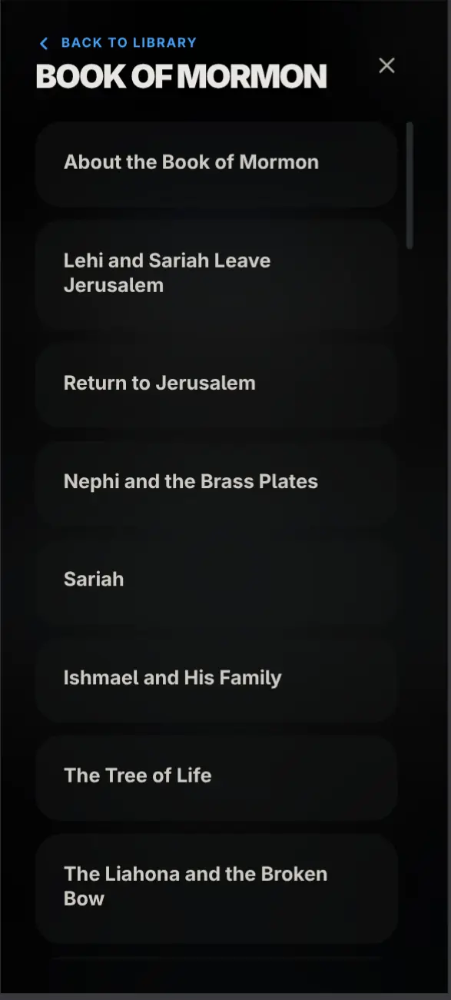

# Scripture Stories
Read [scripture stories](https://www.churchofjesuschrist.org/study/scriptures/scripture-stories?lang=eng) from [The Church of Jesus Christ of Latter-day Saints](https://www.churchofjesuschrist.org/) through an engaging slideshow experience.

> [!TIP]
> Try it out! Visit: https://rparkr.github.io/scripture-stories/
> 
> The backend is served via AWS Lambda; scripture stories are cached to your device for offline viewing, and you can also pre-download all stories at once for a fully offline experience.

> [!NOTE]
> You can also try this out locally, clone this repository and run [backend/main.py](./backend/main.py):
> 
> ```shell
> # Install uv if you don't have it yet
> curl -LsSf https://astral.sh/uv/install.sh | sh
> ```
> 
> ```shell
> # Run the backend
> git clone https://github.com/rparkr/scripture-stories.git
> cd ./scripture-stories/backend
> uv run main.py
> ```
> 
> Output:
> ```
> 📖 Scripture Stories app is now running
> 👉 Go to: http://localhost:8000
> 
> INFO:     Started server process [16835]
> INFO:     Waiting for application startup.
> INFO:     Application startup complete.
> INFO:     Uvicorn running on http://0.0.0.0:8000 (Press CTRL+C to quit)
> ```

## Screenshots
**Desktop view of main page**  


**Smartphone view of a slide in a scripture story**  


**Smartphone view showing story selection**  


**Captions can be hidden by tapping the screen; font size can be adjusted**  


## Disclaimer
This is a hobby project and is not an official website of [The Church of Jesus Christ of Latter-day Saints](https://www.churchofjesuschrist.org/).

I do not own any copyrights for the text or images. The images and text from each scripture story belong to The Church of Jesus Christ of Latter-day Saints and are copyright Intellectual Reserve, Inc.

The website code in this repository is open-sourced under the MIT license.
